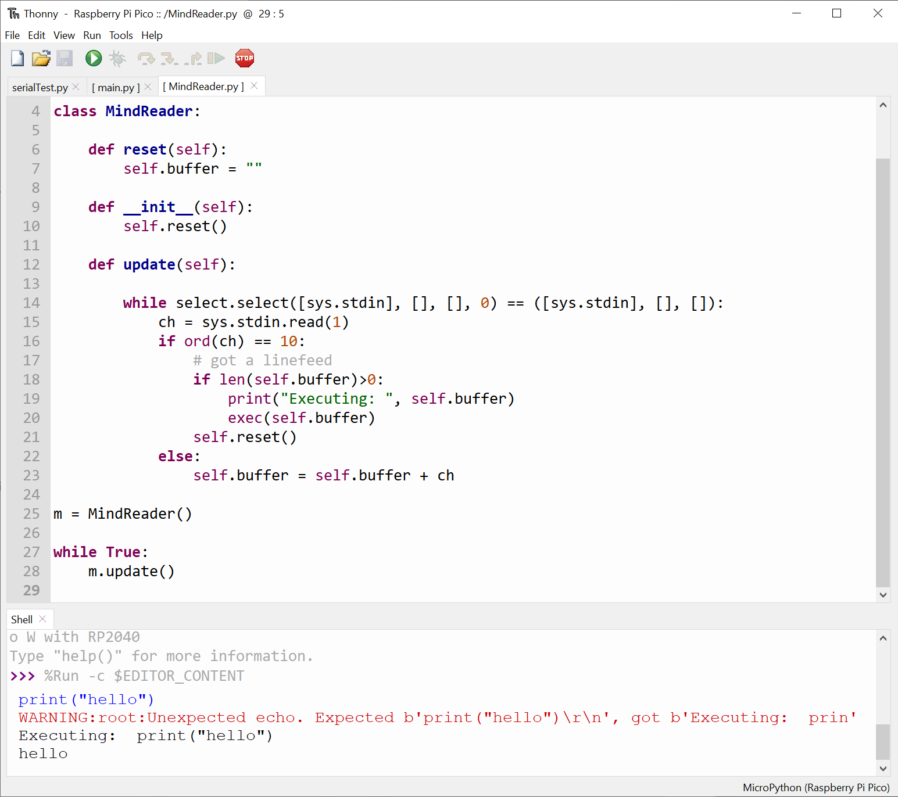

# MicroPythonMindReader
## Look inside the mind of a running MicroPython program

Add the MindReader class to your program. Then make an instance of the class and call update on the instance in the update loop of your application.

The update method scans the serial port and builds up a command. When you press return it executes the line. This means that you can still type in REPL commands when your code is running, which is neat. You can enter print statements to view variables or even modify them for testing. 

It's not pretty, but it works and I find it useful.

Rob Miles